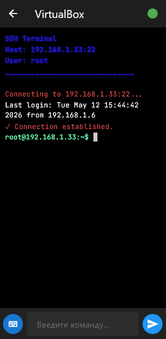
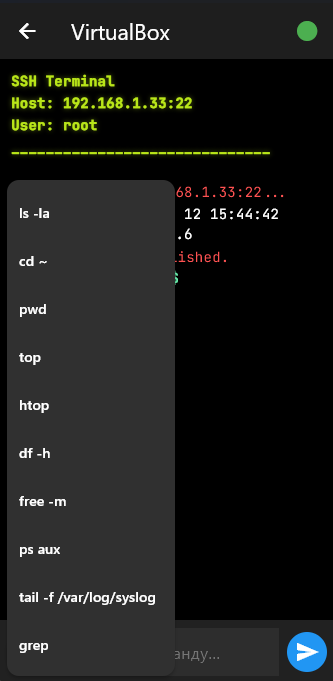

# 🖥️ Flutter SSH Terminal (FSC)

## ✨ Features

- 🔒 **Secure SSH Connections** – Password & key-based authentication
- 📱 **True Cross-Platform** – Runs on Android, iOS, Web, Windows, macOS & Linux
-  **Terminal-Grade UI** – Dark theme, monospace fonts, smooth auto-scrolling & system color accents
- ⚡ **Real-Time Output** – Live streaming, smart echo filtering & prompt parsing
- 📝 **Built-in Nano Editor** – Edit remote files directly from the terminal interface
- 🚀 **Quick Command FAB** – One-tap access to frequently used system commands (`ls`, `top`, `df`, etc.)
- 🧹 **Output Cleaner** – Automatically strips ANSI codes, readline artifacts & duplicate prompts
-  **Reactive State** – Lightweight, efficient, and fully mounted-safe UI updates

---

##  Screenshots

> *(Replace with actual screenshots or GIFs of your app)*
> | Connection & Terminal | Quick Commands FAB |
> |-----------------------|--------------------|-------------|
> | '' | '' |

---

## 🛠️ Tech Stack

- **Framework:** Flutter 3.x
- **Language:** Dart
- **SSH Core:** `dartssh2` / `ssh_client` *(update to your actual package)*
- **UI/UX:** Material 3, Custom Widgets, `TickerProviderStateMixin` animations
- **Architecture:** Feature-first structure, reactive state updates, separation of concerns (models/services/widgets)

---

##  Quick Start

1. **Clone the repository**
   ```bash
   git clone https://github.com/pwnSchmitz/flutter-cpp-ssh
   cd flutter-cpp-ssh

---

## 📁 Project Structure

      📁 lib/
        ├── 📱 app/                           # Main application widget
        │   └── ssh_manager_app.dart          # Root widget with theme & routing
        │
        ├── 📦 models/                        # Data models
        │   ├── ssh_connection.dart           # SSH connection model
        │   └── terminal_line.dart            # Terminal line model
        │
        ├── 🔄 providers/                     # State management providers
        │   └── connection_provider.dart      # Connections state provider
        │
        ├── ️ screens/                       # App screens
        │   ├── 💬 dialogs/                   # Dialog components
        │   │   └── connection_dialog.dart    # Add/edit connection dialog
        │   ├── connection_list_screen.dart   # Saved connections list
        │   ├── nano_editor_screen.dart       # Nano text editor screen
        │   └── terminal_screen.dart          # Main terminal screen
        │
        ├── ️ services/                      # Business logic services
        │   ├── ssh_service.dart              # SSH service (connect, execute)
        │   └── storage_service.dart          # Local storage (SharedPreferences)
        │
        ├── 🛠️ utils/                         # Utilities & helpers
        │   ├── constants.dart                # App constants
        │   └── terminal_cleaner.dart         # ANSI codes & output cleaner
        │
        ├── 🧩 widgets/                       # Reusable widgets
        │   └── terminal_line_builder.dart    # Terminal line renderer
        │
        └── 📄 main.dart                      # App entry point